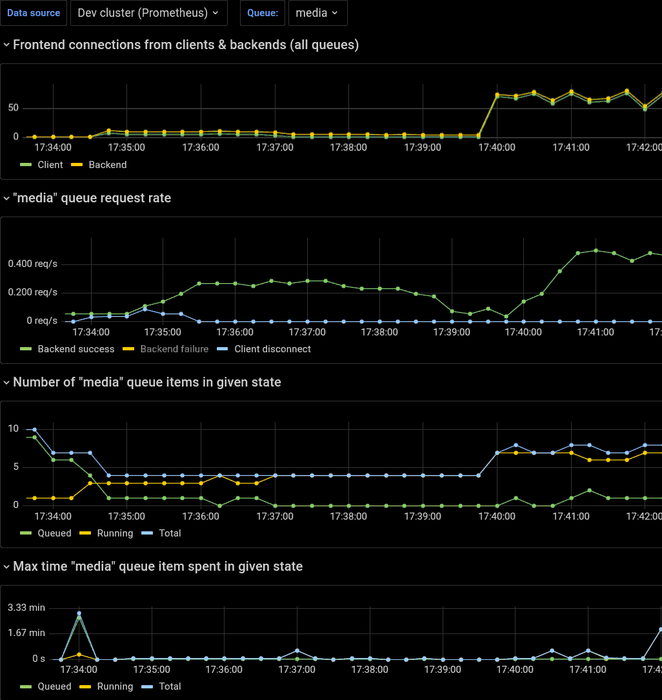
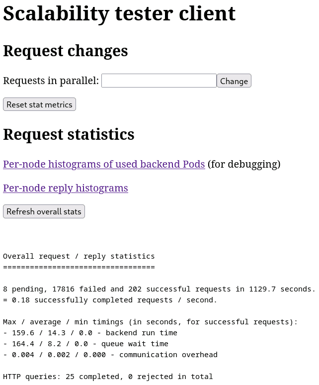

Device Scalability Tester for Kubernetes
========================================

This is a Go based Kubernetes (k8s) device scalability testing
framework. It is intended for pre-production testing done in *secure /
non-production* test clusters.

It provides test backend, frontend and client services, plus a script
for validating expected device / service scalability of workload(s)
configured for the backend.

Frontend provides Prometheus metrics both for for monitoring the scalability, and for
[Horizontal Pod Autoscaling](https://kubernetes.io/docs/tasks/run-application/horizontal-pod-autoscale/)
(HPA). Client provides statistics of request throughput, and which nodes / devices
were used by the backend pod instances, to perform those requests.

Use-cases:
* Validating that scaling works correctly when using
  [fractional device resources](https://github.com/intel/intel-device-plugins-for-kubernetes/tree/main/cmd/gpu_plugin#fractional-resources)
  with
  [GPU Aware Scheduling](https://github.com/intel/platform-aware-scheduling/tree/master/gpu-aware-scheduling)
* Automation for testing real k8s workload parallelization throughput on given device HW
* Automation for stress testing devices and device drivers on multiple nodes in parallel
* Demonstrating k8s device usage scaling of real use-cases using live Grafana graphs
* Testing k8s HPA with application specific external or
  [custom metrics](https://kubernetes.io/docs/tasks/run-application/horizontal-pod-autoscale/#scaling-on-custom-metrics)

See:
* [Design document](docs/README.md)

Links:
* [Intel device plugins for Kubernetes](https://github.com/intel/intel-device-plugins-for-kubernetes/)
* [Simulated device metrics](https://github.com/intel/fakedev-exporter/)


Screenshots
===========

Grafana dashboard for the queue metrics (provided by the test framework frontend):
***

***

Control / statistics Web UI for the test client:
***

***

Web UI node statistics (giving details about the failures in above
screenshot, that were caused by first GPU device on `cfl-s` node being
incompatible with the selected workload, as it was not a discrete one):
***
```
Backend / worker node statistics
================================

 Node | Success replies:
--------+-----------------
cfl-s | ## 3.2% (7)
tgl-h | ########################################################## 96.8% (214)

 Node | Failure replies:
--------+-----------------
cfl-s | ############################################################ 100.0% (20354)
tgl-h |  0.0% (0)


Node: cfl-s
===========

    Device | Completed requests:
-----------+--------------------
renderD129 | ############################################################ 100.0% (7)

Node errors (count / description):
- 20354: /usr/bin/sample_multi_transcode returned error code 247


Node: tgl-h
===========

    Device | Completed requests:
-----------+--------------------
renderD129 | ############################################# 74.3% (159)
renderD128 | ############### 25.7% (55)
```
***
