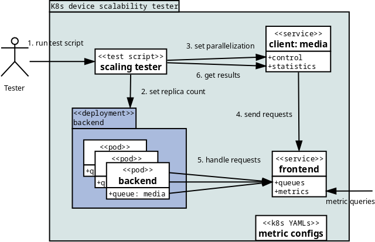

Content
=======

* [Design overview](#design-overview)
  * [TODOs](#todos)
  * [Implementation notes](#implementation-notes)
* [Components](#components)
  * [Backend container](#backend-container)
  * [Frontend service container](#frontend-service-container)
  * [Test client](#test-client)
* [Threading and connection handling](#threading-and-connection-handling)
  * [Frontend](#frontend)
  * [Client](#client)
  * [Backend](#backend)
* [Security](#security)
  * [Privileges](#privileges)
  * [Error handling and logging](#error-handling-and-logging)
  * [Communication details](#communication-details)

Design overview
===============

Framework is composed of 3 components:
* Test client: each client instance sends (constantly) requests to a
  named queue in the frontend
* Backend: each backend / worker instance pulls items from a specific
  frontend queue, runs their given workload for each request, and
  returns result to the frontend
* Frontend: manages the queues, provides metrics of their utilization,
  and passes requests + their replies between clients and backends

Framework is independent of the actual workloads being run, they just
need to be something that backend can invoke as a separate binary,
with (optional) per-request command line argument(s).

TODOs
-----

Client:

* HTML output could look nicer, currently statistics are
  same as for plain text output, just embedded in `<pre>` tags

Frontend:

* Queue implementation is naive/inefficient one - append to end,
  remove from beginning.  Slice-based ring buffer would be more
  efficient, but I'm waiting whether Go gets proper Queue
  implementation with Generics

Backend:

* Timeout limit handling is missing for real workloads
  (it works only for built-in "sleep" test functionality)

Common:

* Move common structure definitions from each component to their own,
  shared module

Implementation notes
--------------------

* If each request and work item using a new frontend connection cause
  too much communication overhead (with larger number of parallel
  requests and backend deployments), connections could be re-used.

  However, that would complicated the design, and should not be needed
  with the expected workload run lengths (at least seconds) and
  replica counts

* Neither backend nor client can be terminated (with ^C) when frontend
  is stuck / suspended, they need to be killed. This is due to signal
  checking being done between messages (to avoid losing messages), but
  them being blocked on frontend read while it's not responding

* Annoyingly, for disconnect detection to work with Golang `conn`
  module, a non-zero sized read with deadline in *future* must be
  used, i.e. it adds delay to request processing. Connection status
  could be checked using `unix` module (by extracting connection FD &
  using syscalls to check its state), but that is not in Golang
  standard library

Components
==========

All 3 components are implemented in Go.  They intentionally use
just the base modules (`json` + `log` instead `gRPC` + `klog`).

Component APIs and features are detailed below.

(All components support "-verbose" option to log contents of all
messages they receive and send.)

Backend container
-----------------

Backend container adds a backend worker on top of an actual workload
container.

Options:
* Frontend address (default="localhost")
* Frontend queue name (default="sleep")
* Glob pattern for FILENAME replacement (default='', no replacement)
* Workload default timeout in seconds (default=0, no timeout)
* Workload work directory and whether its output is discarded
  (default = current dir, output to backend stdout/stderr)
* Whether backend exits when queue empties, or backs off from querying
  it with exponentially increasing timeouts (default=exit)
* Few options for logging, where to get backend pod/node names,
  and how to handle workload args, input & output

Arguments:
* Workload binary name, optionally also arguments

Startup:
* Get (device) file name matching glob pattern, if one is given

Main loop:
* Asks for next service request from the named frontend queue
* Exits when frontend tells that queue is empty, or there's an error
* Replaces "FILENAME" string(s) in options with the glob-matched file name
  * If there's FILENAME string, but no file names were matched, returns
    request error to frontend
* Invokes the workload specified on CLI and waits for it to exit, or for
  default/request timeout, whichever happens first
* Returns workload run time and exit code (or timeout info), along with
  backend pod/node information, back to frontend
* Exits if termination signaled while running workload

Workload examples:
 * sleep – built-in fake workload to simulate just the workload delay
 * fakedev-workload – to simulate both workload delay + metrics
 * Real workloads, like OneVPL transcode, that actually use the GPU

Frontend service container
--------------------------

Options:
* Max queue size (default=unlimited)
* Interval for logging queue statistics in seconds (default=0, disabled)
  * When set, resets max wait + run time info also for Prometheus metrics
* Addresses / port numbers for network endpoints (default="localhost")

Arguments:
* List of accepted queue / backend names (required)

Activity:
* Accepts service requests from clients and adds them to named workqueues
  * Error if queue is not on accepted list, or queue size is exeeded
* Accepts named queue item requests from backend workers
  * Error if queue is not on accepted list, or queue is empty
* Per-worker Go routines waiting for queue item completion, and reporting
  request errors and statistics to requesting client
* Request removed from queue when it's sent to worker
* Logs per-queue metrics at requested interval, including info
  on node/pod worker having highest run time in last period
* Provides per-queue Prometheus metrics

Networking endpoints, for:
* Backends' named work queue item requests:
  * Input: queue name
  * Reply: time limit (0=default), workload args, error string + backend exit code
* Client workload requests:
  * Input: queue name, time limit (0=default), workload args
  * Reply (from backend): workload exit code, queue wait + run time, timeout (0=no),
    error string, backend node, pod and device names
* per-queue Prometheus metrics (HTTP "/metrics"):
  * Number of items waiting in queue, e.g. for Horizontal Pod Autoscaling (HPA)
  * Number of items being processed, but not finished yet (= worker count)
    * And their total
  * Max workload request wait + run time since last query + their total
  * Workload success / fail (return value), and client disconnect counters

Test client
-----------

Options:
* Control / monitoring UI address (default="localhost")
* Frontend service address (default="localhost")
* Frontend queue name, (default="sleep")
* Startup and max number of requests to do in parallel (default=1)
* Backend workload runtime limit in seconds (default=0, 0=default)

Arguments:
* Workload arguments (default=none)

Features:
* Creates specified max number of Go routines for requests
* Starts by allowing specified number of them to do requests in parallel
* Provides following HTTP endpoints:
  - `/fails`: count of failed requests
  - `/nodes`: node statistics for responses
  - `/parallelism` reset stats + set query parallelism to given `value`
    (limited by specified max)
  - `/pods`: pod statistics for responses
  - `/reqs-per-seq`: average requests per second throughput value
  - `/reset`: reset request metrics
  - `/stats`: request statistics
* With several HTTP endpoint output types: `type`=(plain|json|html)
* Continue doing requests, with specified delay between requests,
  until interrupted
* Log statistics at end

Requests statistics include:
* Count of outstanding and completed requests
* Average reqs-per-sec (= completions / (total wait + run + diff))
* min/max/avg timings for completions:
  - queue wait
  - backend run-time
  - their diff to total request completion time
    (= communication overhead)
* Per-node service request histograms for:
  - number of served requests
  - backend run-times
  - device names
  - pod names
* List of error strings

Threading and connection handling
=================================

"Thread" term is used below as alias for Go routines (although Go
routines do not map 1:1 to OS threads).

Frontend
--------

Each of the 3 network endpoints (for client service requests, backend
work requests, and metrics exporting) is listened on its own thread.
New thread is created for each each queue item being processed by a
backend. If queue statistics logging is enabled, that is in its own
thread too.

Queue content is shared between all of these threads.  Each queue has
its own mutex, which is taken when queue state is read or modified by
the threads.  Because queues are created before threads are created,
overall Queues struct does not need locking, only individual queues
under it.

There are also few global counters for tracking connection statistics
with their own mutex within Queues struct.

New connections are created when client or backend request is
accepted, and closed after given request is handled.

Client
------

Each parallel request is done from its own thread, and each request
uses its own connection.  On request completion, its connection is
closed at both ends.

At start a maximum configured number of threads are started for
these requests, with each having an item in channel array for
controlling whether it can run. This way main thread can throttle
request parallelization to desired value.

Each request thread updates mutex-protected global statistics for
request / reply status.  Separate HTTP server thread provides the
statistics when requested.

Note: instead of using mutex, reply info could be channeled to
statistics maintainance thread.  Threads (e.g. HTTP server one) that
want statistics could ask (through another channel) it to be output in
specified format to given file handle.

Backend
-------

Does not thread.  Each work item query + reply combo is done through a
new frontend connection.  On item completion, its connection is closed.

Security
========

This is an unsecured scalability tester, so run it only in a *secure /
non-production* test cluster with trusted clients.

Turning it into a production service is out of scope, and would need
(at least) communication channel securing, authentication, and
workload specific request securing (filtering etc).

While there are ways to do that securing externally, there are also
more generic, popular workqueue services like RabitMQ, which already
support those features.  Production servers should utilize them, and
use this just as an example of how a (GPU) device service would work,
scale and integrate with Kubernetes.

Privileges
----------

Test framework components do not need, and should not be run with any
extra privileges.  Backend (container) process which invokes a
workload using device files like a GPU, should be granted access only
to a suitable device and nothing else.

Included Kubernetes integration files drop all potential privileges
and run the containers with nobody user/group ID, with only media
backend having suitable group ID and access to a single GPU device.

Error handling and logging
--------------------------

Backend:
- On errors returned by executed workload, or related to its arguments
  provided by frontend, error is returned to remote frontend service
- On all other errors, error is logged and backend terminated

Frontend:
- Errors related to backend and client communication are logged, but
  do not terminate the frontend
- On all other errors, error is logged and frontend terminated

Client:
- On failures related to (test control & stats) HTTP queries,
  error is logged and returned to requester
- On all other errors, error is logged and test client terminated

With `-verbose` option:
- Above components log their network traffic in addition to errors and warnings
- Because logged content is *NOT* filtered in any way, browsing logged malicious
  input could be a security issue, depending on the viewing environment
- There's also a lot of it, which could hide real errors / warnings

=> Enable `-verbose` logging / output only to temporarily debug connectivity issues.

Communication details
---------------------

Test famework component communication is done in JSON over TCP, with
message sizes being (1KiB) limited, and content validated by Golang
JSON->struct unmarshaling code.

Client control and statistics endpoints are provided over HTTP from
pre-defined paths for (max 4KiB) GET methods with no BODY.  Anything
else is rejected outright.  Escaping is done for the external data
(strings in structs received from frontend) included to the HTML
output.

Client can provide workload arguments for backend in the requests, but
backend ignores them if invoked with the "-ignore" option. That option
should be used when doing scalability tests with backend running real
workloads in a cluster which may not be properly secured.
